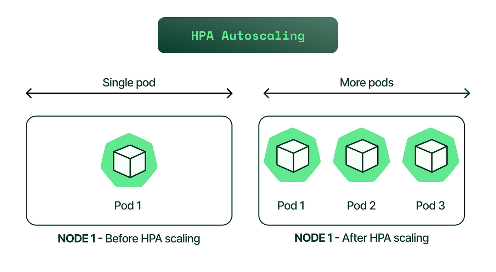
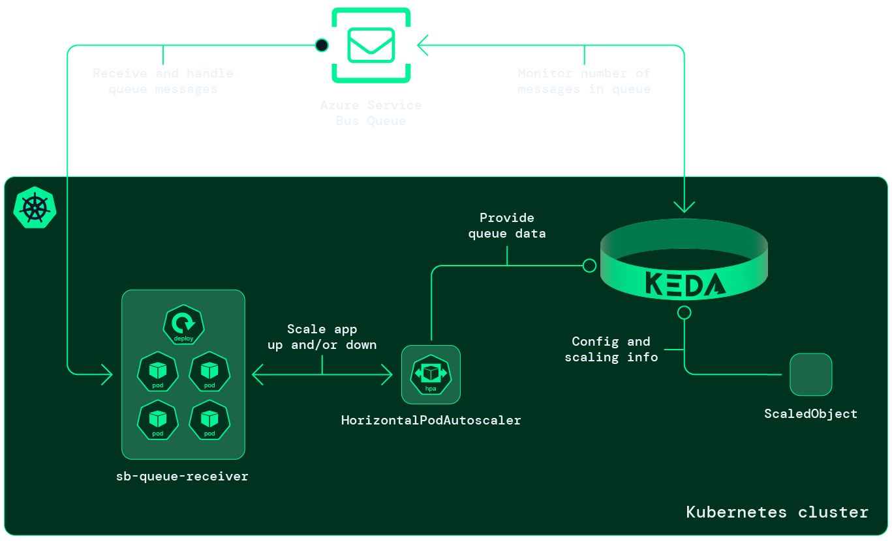

# Autoscaling in Kubernetes

## Manually scaling k8s resources
- For the horizontal scaling can manually scale the number of pods by simply set replicas as env variable and set it to the desired number 
of pods in replicas property utilizing token replacement strategy.
- Also, you can manually scale the number of pods in a deployment or replica set using the `kubectl scale` command.

## Introduction

Autoscaling is a feature in Kubernetes that allows you to automatically adjust the number of pods in a deployment or
replica set based on the resource usage of the pods. This helps to ensure that your application can handle varying
levels of traffic and load without manual intervention.
Plays a key role in ensuring that your application can handle varying levels of traffic and load without manual
intervention. Kubernetes provides two types of autoscaling: Horizontal Pod Autoscaler (HPA) and Vertical Pod
Autoscaler (VPA).

## Vertical Pod Autoscaler (VPA)

Vertical Pod Autoscaler (VPA) is a Kubernetes feature that automatically adjusts the resource requests and limits of
your pods based on their actual usage. This helps to ensure that your pods have enough resources to run efficiently
without wasting resources.
VPA works by monitoring the resource usage of your pods and adjusting their resource requests and limits based on the
observed usage.

[Vertical Pod Autoscaler](https://kubernetes.io/docs/tasks/run-application/vertical-pod-autoscaling/)


## Horizontal Pod Autoscaler (HPA)

Horizontal Pod Autoscaler (HPA) is a Kubernetes feature that automatically adjusts the number of pods in a deployment or
replica set based on the resource usage of the pods. This helps to ensure that your application can handle varying
levels of traffic and load without manual intervention.
HPA works by monitoring the resource usage of your pods and adjusting the number of pods in a deployment or replica set
based on the observed usage.

- HPA adjusts the number of pod replicas in a deployment or statefulset based on observed CPU, memory, or custom metrics
  like request latency.
- Metric selection: Use CPU utilization or application-specific metrics like requests per second (via Prometheus and
  custom metrics) to scale pods based on actual traffic patterns.
### Configuration:

1. Set minimum and maximum replica counts (e.g., higher max replicas during peak hours).
2. Set target utilization thresholds that trigger scaling. For example, you might set a CPU target of 60% for peak
   hours. The metrics highly depend on the application type and its requirements, because one app is fine running on 90%
   CPU but other will throttle requests.


### Combining VPA and HPA

- You should avoid using both VPA and HPA on the same deployment or replica set, as they may conflict with each other
  and
  cause unexpected behavior. If you absolutely need to use both, make sure to carefully configure them to avoid
  conflicts.

[Horizontal Pod Autoscaler](https://kubernetes.io/docs/tasks/run-application/horizontal-pod-autoscale/)


### Native HPA:
- Native HPA supports CPU,memory metrics, and more(http_requests_per_second).
- The common use for HorizontalPodAutoscaler is to configure it to fetch metrics from aggregated APIs (metrics.k8s.io, custom.metrics.k8s.io, or external.metrics.k8s.io).
- In some cases, you may need to scale based on custom metrics.
- Different applications have different requirements, one app is fine running on 90% CPU but other app will throttle
  requests on 40% CPU usage.
- Some applications may have specific requirements that cannot be met by the native HPA, so you need custom strategy based on app requirements.
- Good approach is to use custom client metrics.
- There is 4 golden signals that you can use to scale your pods:
```text
Latency
Traffic
Errors
Saturation
```
- Latency: The time it takes for a request to be processed by your application.
- Traffic: The number of requests your application is receiving.
- Errors: The number of errors your application is generating(for the API's it's how much HTTP 5xx errs).
- Saturation: The percentage of resources being used by your application.(native HPA)
- Native metric server can only provide CPU and memory metrics, so you need to use custom metrics to scale your pods
  based on other metrics like request latency or error rates.
- You can use Prometheus and Grafana to gather custom metrics and use them to scale your pods.
- Another approach is to use Azure Monitor to gather custom metrics and use them to scale your pods.


## Scheduled Scaling

- In addition to HPA, you can schedule scaling actions based on your known traffic patterns:
- Use CronJobs or Kubernetes Cluster Autoscaler with scheduled scaling policies to pre-emptively scale resources.
- For example, at 7:30 AM you can scale up pods/nodes, and at 3:30 PM, you can scale down resources, anticipating the
  traffic spike and fall.
- This approach is useful for applications with predictable traffic patterns.

## Node Pool Management(Spot instances):
- For better resource utilization and cost savings, you can manage node pools based on your workload requirements.
- For example if you have the app that needs a lot off resources and ancients, and highly availability is not concern, you can use spot instances.
- Also, you can create different node pools for peak and off-peak hours, optimizing cost.
- Also, you can use different instance types for different node pools based on the workload requirements.
- For example, have a pool of spot instances during off-peak hours to save costs while relying
  on on-demand instances during peak hours for reliability.
- If you need large amount of pods, you can use spot instances for cost savings.

## Cluster Autoscaler:

- Cluster Autoscaler automatically adjusts the number of nodes in your cluster based on the resource requirements of
  pods.
- When HPA scales your pods up and there’s not enough available resources on existing nodes, Cluster Autoscaler can
  provision more nodes.
- Similarly, it can remove nodes when resources are underutilized during off-peak hour.

## Keda Autoscaler:

- Keda is a Kubernetes-based Event Driven Autoscaler that allows you to scale your pods based on external events.
- For example, you can scale your pods based on the number of messages in a queue or the number of requests to an API.
- You can gather metrics from external sources like Azure Queue, Kafka, or Prometheus and use them to scale your pods.
- Keda is useful for applications that have unpredictable traffic patterns or that need to scale based on external
  events.
- It can be used in conjunction with HPA to provide more granular control over scaling.
- Also, it can be used to scale down to zero pods when there is no traffic, saving resources and costs.
- Keda can be used to scale up pods based on the number of messages in a queue or the number of requests to an API.
- Keda can be used to scale pods based on custom metrics like request latency or error rates.
- Keda can also scale up and down resources based on chronological events like time of day or day of the week.
- Keda can be applied to every resource that has Scale subresource, like Deployment, ReplicaSet, StatefulSet, etc.
```text
scale.replicas
status.replicas
status.labelSelector
```
- The image below shows how Keda can be used to scale pods based on the number of messages in a queue.

### Custom dedicated autoscaler application:
- Kubernetes provides a framework for building custom autoscalers that can be used to scale your pods based on custom
  metrics or requirements.
- K8s is natively built in go language, so you can write your own autoscaler them will do the custom logic.
- In my opinion, it is better to use Keda as it is a mature project and has a lot of features and integrations.
- If you need a lot of customization, you can create different metrics in prometheus and use them in Keda.
### Other Autoscaling Tools:

- Prometheus Adapter: Use Prometheus metrics to scale your pods based on custom metrics like request latency or error
  rates.
- Metrics Server: Collect resource usage metrics from your cluster and use them to scale your pods.
- Custom Metrics API: Use custom metrics from external sources to scale your pods based on your application’s specific
  requirements.
### Gather Metrics:
- Aure gives to us a metrics server that monitors the aks cluster so it is good option to.
- The industry standard for monitoring is Prometheus and Grafana, so you can use them to gather metrics and use them in
  Keda.
- Prometheus is a monitoring and alerting toolkit that collects metrics from your applications and stores them in a
  time-series database. It is open-source and can be easily integrated with Kubernetes.
- Grafana is a visualization tool that allows you to create dashboards and graphs to visualize your metrics. It can be
  used to create custom dashboards for your applications and monitor their performance.
- Prometheus has deeper learning curve than Azure metrics server, but it is more powerful and flexible.
- The metrics that are important to us are:
```text
CPU utilization
Memory utilization
Request latency
Error rates
Number of messages in a queue
Number of requests to an API
...
```

### Important Tips:

- Fine-tune pod resource requests and limits for better scaling. Use different metrics for different workloads.

## Other Resources:

#### Pod Disruption Budgets:

- Pod Disruption Budgets (PDBs) allow you to define the minimum number of pods that must be available during
  disruptions.
- This is useful when you want to ensure that a certain number of pods are always available to handle traffic.
- For example, you can set a PDB to ensure that at least 50% of your pods are available during maintenance or
  upgrades.

